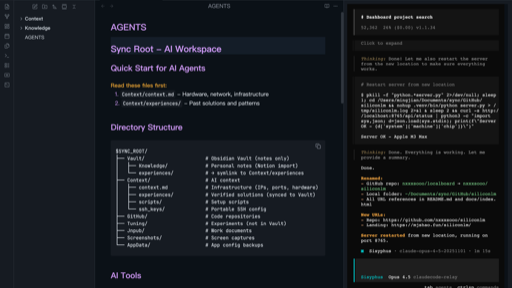

<p align="center">
  
</p>

<h1 align="center">OpenCode Themes</h1>

<p align="center">
  <strong>Terminal-inspired dark themes for <a href="https://obsidian.md">Obsidian</a> and <a href="https://typora.io">Typora</a>.</strong><br/>
  Deep blacks · Precise contrast · Built for focus.
</p>

<p align="center">
  <a href="https://nxxxsooo.github.io/opencode-themes"></a>
  <a href="LICENSE"></a>
  <a href="https://github.com/nxxxsooo/opencode-themes/stargazers"></a>
</p>

---

## Design Philosophy

> Write in the dark. Focus on the code.

OpenCode Themes bring the terminal to your writing tools — deep blacks, precise contrast, and a palette tuned for extended reading and writing sessions. Inspired by [OpenCode](https://github.com/sst/opencode) and [Ghostty](https://ghostty.org) terminal aesthetics.

---

## Editors

| Editor | Status | Source |
|--------|--------|--------|
|  | ✅ Published to Community Themes | [`obsidian/`](obsidian/) · [Standalone Repo](https://github.com/nxxxsooo/obsidian-opencode-theme) |
|  | ✅ Ready | [`typora/`](typora/) · [Standalone Repo](https://github.com/nxxxsooo/typora-opencode-theme) |

---

## Color Palette

| | Element | Hex | Role |
|---|---------|-----|------|
| 🟣 | **Primary Accent** | `#8a6cc4` | Links, interactive elements |
| 🟪 | **Purple** | `#d19af8` | Headings, keywords |
| 🟢 | **Cyan** | `#5fd4bb` | Tags, properties, strings |
| 🟡 | **Gold** | `#f0a830` | Bold text, highlights |
| 🔴 | **Red** | `#ff8299` | Errors, deletions |
| 🔵 | **Blue** | `#7aa2f7` | Selections, focused states |
| 🟩 | **Green** | `#9ece6a` | Strings, success |
| 🟠 | **Orange** | `#ff9e64` | Values, numbers |
| 🩵 | **Sky** | `#89ddff` | Operators |
| ⬛ | **Background** | `#0d1117` | Deep black base |
| ⬜ | **Text** | `#f0f6fc` | High contrast foreground |

---

## Features

#### ⌨️ Terminal-First Design
Color scheme derived from OpenCode/Ghostty terminal — feels native to developers.

#### 👁️ High Contrast
`#f0f6fc` on `#0d1117` — optimized for readability in dark environments.

#### 📝 Full Syntax Highlighting
Complete token coverage — keywords, strings, functions, properties, operators all precisely colored.

#### 🖨️ Print Ready (Typora)
Clean light export for PDF and print output.

#### 🎨 Accent Customizable (Obsidian)
Override the purple accent via **Settings → Appearance → Accent Color**.

#### 🀄 CJK Optimized
PingFang SC / Noto Sans SC for beautiful Chinese/Japanese/Korean text.

---

## Installation

### Obsidian

**From Community Themes:**

1. Open **Settings** → **Appearance** → **Themes**
2. Click **Manage** → **Browse**
3. Search for `OpenCode`
4. Click **Install and use**

**Manual:**

1. Download [`theme.css`](obsidian/theme.css) and [`manifest.json`](obsidian/manifest.json)
2. Create folder: `{vault}/.obsidian/themes/OpenCode/`
3. Place both files in the folder
4. Enable in **Settings** → **Appearance** → **Themes**

### Typora

1. Download [`opencode.css`](typora/opencode.css)
2. Open Typora → **Preferences** → **Appearance** → **Open Theme Folder**
3. Copy `opencode.css` into the theme folder
4. Restart Typora and select **OpenCode** from the theme menu

---

## Typography

| Element | Font |
|---------|------|
| Body text | PingFang SC, system sans-serif |
| Code | JetBrains Mono, Fira Code, Cascadia Code |
| Display (web) | Space Grotesk |

> **Tip**: Install [JetBrains Mono](https://www.jetbrains.com/lp/mono/) for the best code block experience.

---

## Repository Structure

```
opencode-themes/
├── obsidian/           # Obsidian theme
│   ├── theme.css       # Main theme stylesheet
│   ├── manifest.json   # Obsidian manifest
│   └── screenshot.png  # Theme preview
├── typora/             # Typora theme
│   ├── opencode.css    # Main theme stylesheet
│   └── opencode/       # Asset folder (fonts/images)
├── website/            # Landing page
│   └── index.html      # Static site for GitHub Pages
└── README.md
```

---

## Credits

- Terminal aesthetic from [OpenCode](https://github.com/sst/opencode)
- Font rendering tuned for [Ghostty](https://ghostty.org)
- README format inspired by [Bloom Theme](https://github.com/webkubor/typora-Bloom-theme)

---

## License

[MIT](LICENSE) © [nxxxsooo](https://github.com/nxxxsooo)
